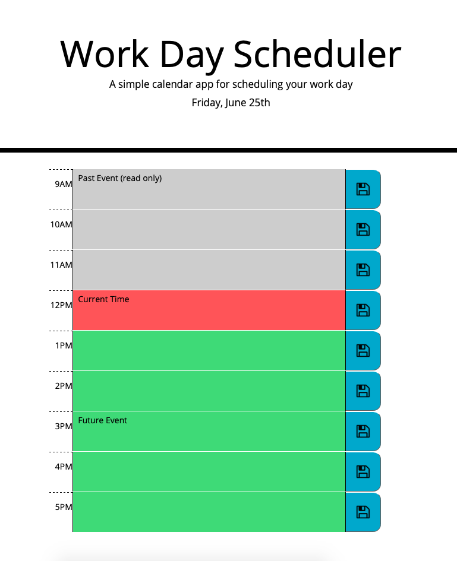

# hw-5

Work Day Scheduler:
Enter your activity in the relevant timeslot and click the save icon to save the activity to local storage. When this is done the activity persists on page reload. Timeslots in the past are grey and read only.

Screenshots:

Created by David Ludwik

The program first pulls the current date and time via a moment api call. The schedule is stored as a JSON strigified array. An array of timeslot references are then looped through and populated, colored, and write statused via the schedule array, each being compared to the current hour. Each save button has its own on click action listener function that, upon activation, updates local storage to the corresponding value in the text area.

